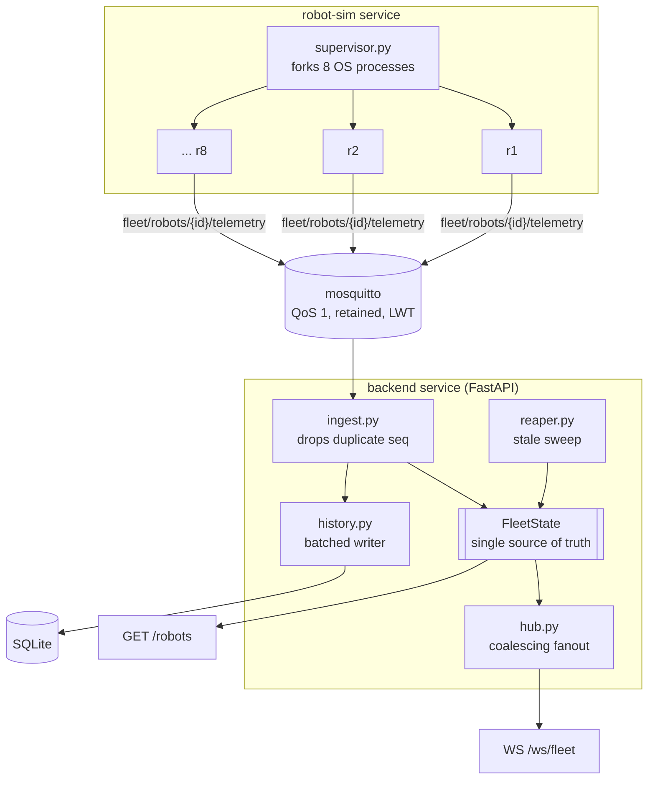

# System design

## The system these answers refer to

Three compose services. The two interfaces at the bottom share a colour in the sense that
matters: they read the same `FleetState` object, so there is no arrow between them to draw.

---

## 1. Adding a new feature later

Take a concrete one: **the operator can recall a robot to its dock.**

Nothing about ingest changes, because the producer/consumer split already has a return
path — the robots hold an open MQTT session, they just do not currently subscribe to
anything. The feature lands in four places. A third topic, `fleet/robots/{id}/command`,
which the backend publishes to and `sim/robot.py` subscribes to in `connect()`. A
`POST /robots/{id}/commands` route in `backend/app/main.py`, sitting alongside the existing
read routes. A `pending_command` field on `RobotState` in `backend/app/models.py`, which
`serialize_robot()` picks up — and because that is the single serializer both interfaces
call, the field appears on the WebSocket stream and the REST endpoint simultaneously, with
no second edit and no possibility of the two drifting. And an acknowledgement path, which is
just another status the robot reports through the telemetry topic that already exists.

The design accommodates this without rework, and the reason is specific: state is written
in exactly one place (`FleetState.apply`), serialized in exactly one place
(`serialize_robot`), and fanned out in exactly one place (`Hub.publish`). A new field
threads through all three by touching each once.

The cheaper class of change is cheaper still. Adding a telemetry field is one line in
`Telemetry` and one in `RobotState`. Changing what counts as needing attention — the thing
most likely to be asked for — is an edit to the `STATUS_CLASS` dict in
`backend/app/health.py`, which is why that judgement lives in one dict in one file rather
than being spread across the routes that consume it.

The change that *would* require rework is a second backend replica, and that is Q2.

## 2. Eight robots to five hundred

Ingest is not the problem. 500 robots at the recorded 5s cadence is 100 messages/second;
each one is a pydantic validation and a few dict operations, and Mosquitto is designed for
orders of magnitude more publishers than that.

**The first thing that breaks is per-client fanout serialization in `stream_fleet`**
(`backend/app/main.py`). It is the only cost in the system that scales with the *product*
of two growing quantities rather than with either alone: for every change, for every
connected client, it calls `serialize_robot` and builds a fresh JSON frame. At 8 robots and
a couple of dashboards that is invisible. At 500 robots and 20 clients it is 100 changes/s
× 20 = 2,000 serializations per second of *identical data*, 20× redundant, all on the one
event loop that ingest and the reaper also run on. The first visible symptom is not a crash
but WebSocket latency jitter, as fanout and ingest contend for the same thread.

The fix is ordered by leverage. Serialize each changed robot **once per tick** into a shared
buffer and write the same bytes to every socket — that alone removes the client multiplier.
Then move from per-event to fixed-interval framing (say 4 Hz), which bounds frame count
independently of event rate. Then per-client subscription filtering, so a dashboard showing
one zone is not paying for 500 robots.

The **second** thing to break is specific to the reconnect design and worth naming: with
retained messages on every telemetry topic plus `clean_session=False`, a backend restart at
500 robots receives 500 retained messages instantly, plus whatever QoS 1 backlog queued
while it was away. `Hub` absorbs that for WebSocket clients by construction — the coalescing
buffer is bounded by roster size — but `handle_message` still runs per message and
`HistoryWriter.record` still buffers each one, so the restart cost grows linearly with fleet
size in a burst rather than spread over time.

Only *after* both of those does the single replica become the wall. That is where the
in-process dict stops being the right answer: `FleetState` moves to a Redis hash, ingest
load-balances across replicas via MQTT 5 shared subscriptions
(`$share/backend/fleet/robots/+/telemetry`), and Redis Pub/Sub carries fanout between them.
Note what that costs: consistency stops being structural and becomes coordinated, which is
exactly the property Q1 of `ANSWERS.md` currently gets for free.

## 3. Constrained bandwidth

Measured, not estimated: a publisher message is **172 bytes** of JSON and the backend's
serialized form is **272 bytes**; a full 8-robot snapshot is 1.9 KB, which extrapolates to
roughly 119 KB at 500 robots. Per robot that is ~34 bytes/second sustained — fine on
Ethernet, wrong on a shared radio link.

What I would change, in order of payoff per unit of effort:

**Send less per message.** `build_message` in `sim/robot.py` currently sends full state
every time. Most fields are unchanged between consecutive readings — a parked robot
republishes an identical position 180 times. Delta encoding against the last acknowledged
value, with a periodic full keyframe so a late subscriber can resynchronise, removes most of
it. Quantize while doing so: the layout is 1px = 1 unit, so `x: 602.7` carries a decimal of
pure simulation noise, and battery to 0.5% steps loses nothing an operator can act on. That
is roughly 172 → ~40 bytes.

**Match QoS to whether loss is self-correcting.** Position at QoS 0 — a dropped fix is
superseded by the next one 5 seconds later, so paying for acks and redelivery buys nothing.
Status *transitions* stay at QoS 1, because a missed `idle → error` is not self-correcting
and would leave the operator's view wrong indefinitely. This is a topic split:
`.../position` and `.../status`, which also lets a bandwidth-constrained consumer subscribe
to only the second.

**Send less often, adaptively.** Fixed 5s cadence regardless of activity is wasteful in both
directions. Publish on meaningful change plus a slow heartbeat: fast while moving, slow while
idle or charging. The heartbeat has to stay, because `reaper.py` infers death from silence —
drop it entirely and every parked robot would be reported stale.

Beyond that, CBOR or msgpack instead of JSON for another ~30%, and on the consumer side the
fixed-interval framing from Q2 doubles as egress control.

## 4. A robot goes down mid-task

Two detectors, deliberately, because each one is blind to what the other catches.

**MQTT Last Will** (`sim/robot.py::connect`) fires within roughly 1.5× the 15s keepalive
when the TCP connection dies — process crash, container kill, network cable. The broker
publishes `{"online": false}` to `fleet/robots/{id}/availability` on the robot's behalf;
`handle_message` routes it to `FleetState.set_availability`, and `classify()` in
`backend/app/health.py` returns `ATTENTION` for anything not `online`. This is the fast path
and it costs nothing at runtime, because the broker is already tracking the connection.

**The reaper** (`backend/app/reaper.py`) sweeps every 2 seconds and marks any robot whose
last reading is older than `STALE_AFTER_S` (15s, three missed reports at the 5s cadence).
This catches what LWT structurally cannot: a robot whose socket is still open but which has
stopped saying anything — wedged firmware, a sensor thread deadlocked, a network path that
passes keepalives but drops publishes. LWT would never fire there, because from the broker's
point of view the client is perfectly healthy.

What the rest of the system does: the robot flips to `attention`, the version bumps, and
`Hub.publish` pushes it to every subscriber, so a WebSocket client learns about it in the
same frame format as any other change and a poller sees it on its next request — both from
the same committed transition, which is the point.

Critically, **the robot is not removed from state**. It keeps its last known position with
`stale: true` and a `last_seen_s` age. A robot that disappears from the operator's view is
far worse than one visibly frozen where it died — the operator needs to know *where* to send
someone, and a vanished dot silently becomes a robot nobody is looking for.

## 5. Slow, unreliable, or absent updates

**During the disruption**, consumers see the robot's last committed state, marked
`stale: true` with a growing `last_seen_s`, and classified `attention`. Not a gap, not a
guess, not an extrapolated position — the last thing actually reported, explicitly labelled
as old. The operator can tell the difference between "here is where it is" and "here is where
it last was, 40 seconds ago," which is the distinction that matters when deciding whether to
walk over to it.

**Out of order and duplicated** is handled by the `seq` guard in `FleetState.apply`. A
reading that arrives after a newer one has already been applied is dropped rather than
applied, so the robot never teleports backwards to a position it had already left. QoS 1
redelivery and genuine network reordering are indistinguishable at the receiver, and the same
single comparison covers both. `test_redelivery_does_not_move_a_robot_backwards` pins it.

**Gaps** are explicitly *not* treated as errors. `test_higher_seq_after_a_gap_applies`
asserts that a reading jumping from seq 1 to seq 500 is accepted — only *older* readings are
refused, never newer ones. Getting this backwards would wedge a robot permanently the first
time it lost a message, which is a far worse failure than the missing data itself.

**On recovery**, the publisher's `clean_session=False` session means the broker delivers the
QoS 1 backlog it queued. `apply()` walks it in arrival order, but only the newest reading
advances current state; every earlier one fails the `seq` comparison and is dropped. So the
live view **snaps forward to now** rather than replaying three minutes of stale motion —
which is what an operator making a decision actually needs.

The intermediate readings are not lost, though, and this is the one place the two concerns
are deliberately separated. `handle_message` in `backend/app/ingest.py` records to history
*before* consulting `apply()`, so every valid reading is persisted whether or not it moved
the live view; the primary key on `(robot_id, seq)` in `backend/app/history.py` makes that
safe against redelivery. Had history followed the live view instead, it would have been
empty for exactly the window someone wanted to inspect after an outage.
`test_a_late_reading_is_kept_even_though_it_did_not_advance_state` pins the distinction:
the straggler is refused by state and kept by history, in the same call.

A WebSocket client that drops needs no special handling at all: it reconnects, and
`Hub.connect()` gives it a fresh snapshot. Recovery is the same code path as first connect,
so there is no separate resynchronisation logic to get wrong.
