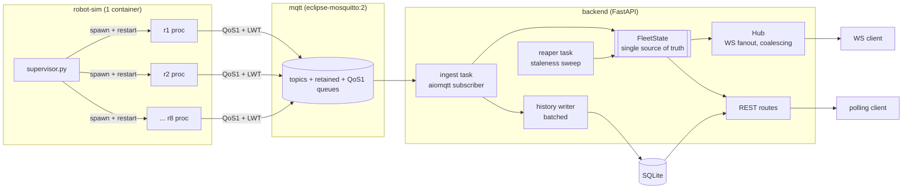

# Peppermint SDE-1 Challenge — Assignment 2 (Backend) Plan

> Supersedes the earlier generic CRUD fleet-management plan in this file. That plan
> was written before the challenge PDF was available and does not apply.

**Stack:** FastAPI (Python 3.12) · Mosquitto (MQTT) · in-process `FleetState` · SQLite · pytest · Docker Compose
**Timebox:** 6–10 focused hours. **Deadline:** 4 days from receipt.

---

## 1. What the challenge actually grades

Read the PDF as a rubric, not a spec. Five things carry the score:

| Weight | What they check | Where it's won |
|---|---|---|
| Hard gate | `docker compose up` boots the whole thing on **x86_64 Linux**, no manual steps | `docker-compose.yml`, base image choice |
| Hard gate | Robots are **separate OS processes**, not 8 coroutines | `sim/supervisor.py` |
| High | REST and WS **cannot disagree** | `FleetState` being a single shared object |
| High | Delivery guarantees + reconciliation with fanout | MQTT QoS 1 + `seq` dedup |
| High | The three markdown docs | `README.md`, `ANSWERS.md`, `SYSTEM_DESIGN.md` |

The docs are roughly a quarter of the surface area. Budget real time for them — see §9.

**Design for the walkthrough call.** They will ask you to make a small change live. The
likely asks are: add a status, change what counts as "needs attention", change the publish
rate, add a telemetry field. Each of those must be a one-line edit in an obvious place.
That constraint drives several decisions below.

---

## 2. Data facts (verified, not assumed)

- 1,448 events = **181 per robot × 8 robots**, exactly 5s apart, `t` = 0…900. No gaps, no dupes.
- 8 robots: `r1`–`r8`, 4 `picker` / 4 `hauler`.
- Battery range 13.1–96.5. Position stays inside the 900×560 layout (x 5–791, y 5–418).
- Status counts: `idle` 590, `on_mission` 157, `active` 151, `blocked` 147, `error` 147,
  `maintenance` 98, `offline` 85, `charging` 73.
- Only **2** `task_event` rows, and they're unpaired (`task_completed` at t=55 arrives before
  any `task_started`). Carry them through as an optional field; don't build logic on them.

**The consequence that matters:** the log is perfectly clean. It contains no drops, no
reordering, no jitter. But the PDF grades you on flaky networks and reconnects. So the
unreliability has to be **injected by your publishers**, or you ship reconnect code that
never executes and can't be tested. That's what the chaos knobs in §5 are for.

---

## 3. Architecture



Three compose services. One broker, one backend, one simulator container that forks 8
real processes.

### Why MQTT over Redis Pub/Sub

Redis Pub/Sub is at-most-once with no persistence and no replay — answering "what are your
delivery guarantees?" with "none" is a fight you don't need. Mosquitto costs the same one
container and pays for itself three times over:

- **QoS 1** → at-least-once, a real guarantee to reason about.
- **`clean_session=False`** → the broker queues messages for your backend while it's
  restarting, instead of losing them.
- **Last Will & Testament** → the broker announces a robot's death *for* you when the TCP
  connection drops. This is the whole answer to SYSTEM_DESIGN Q4, at protocol level.
- **Retained messages** → a restarted backend gets last-known state for all 8 robots
  instantly on subscribe. Free warm start.

It's also what real robot fleets speak, at a robotics company.

---

## 4. Message contract

### Topics

| Topic | QoS | Retain | Purpose |
|---|---|---|---|
| `fleet/robots/{id}/telemetry` | 1 | yes | position, battery, status |
| `fleet/robots/{id}/availability` | 1 | yes | `online` on connect; `offline` as LWT |

Two topics, deliberately. `availability` is *connection* state (set by the broker via LWT);
`status` inside telemetry is *operational* state (`idle`/`error`/…). Conflating them is a
trap — `status: "offline"` in the log means "robot reports itself offline", which is not the
same as "we stopped hearing from it."

### Envelope

The raw log line isn't enough. `t` is a replay offset, not a timestamp — and it resets to 0
every time the log loops. Publishers wrap each event:

```json
{
  "robot_id": "r3",
  "seq": 42,
  "ts": 1725379200123,
  "t": 210,
  "x": 334.1, "y": 29.1,
  "status": "on_mission",
  "battery": 34.4,
  "task_event": null
}
```

- **`seq`** — monotonic per robot, never resets across loops. The dedup key.
- **`ts`** — publisher wall clock (ms). The staleness key.
- **`t`** — kept for provenance; proves the feed is sourced from the log, which the PDF
  explicitly cares about.

**`seq` is how you reconcile at-least-once ingest with exactly-once fanout.** `FleetState.apply()`
drops anything with `seq <= last_seq[robot_id]` and returns `None`, so duplicates and late
arrivals never reach the WS hub. That single guard is the direct answer to ANSWERS Q2 —
write it as one obvious, well-named function.

---

## 5. Robot simulator (`sim/`)

`supervisor.py` — reads `robots.json`, `subprocess.Popen` one child per robot, restarts any
child that exits. This is the service the PDF asks for: *"One of those services should run a
script that starts the robot simulation."*

`robot.py` — a single robot, one process:
1. Load only its own lines from `events.jsonl`, sort by `t`.
2. Connect to MQTT with `client_id = robot_id`, `clean_session=False`, LWT set on
   `availability` → `offline`.
3. Publish `availability: online` (retained).
4. Walk events, sleeping `(t_next - t) / SPEED`. Loop forever; `seq` keeps climbing.

**Env knobs** (these are the deliverable, not decoration):

| Var | Default | Purpose |
|---|---|---|
| `SPEED` | `10` | 10× → the 15-min window replays in 90s. Demo-able. |
| `CHAOS_DISCONNECT_PROB` | `0` | Per-publish chance of dropping the MQTT connection and reconnecting with backoff |
| `CHAOS_JITTER_MS` | `0` | Random publish delay → out-of-order arrival |
| `CHAOS_DROP_PROB` | `0` | Silently skip a publish → gaps |

Off by default so the graders see a clean run. A `chaos` compose profile turns them on, and
the tests use them. This is what makes your reconnect story demonstrable rather than claimed.

---

## 6. Backend (`app/`)

### `FleetState` — the single source of truth

```python
class FleetState:
    _robots: dict[str, RobotState]
    _last_seq: dict[str, int]
    _version: int

    def apply(self, msg: Telemetry) -> RobotState | None:  # None = dup/stale, no fanout
    def set_availability(self, robot_id: str, online: bool) -> RobotState
    def snapshot(self) -> FleetSnapshot   # what BOTH /robots and the WS hello frame return
    def sweep_stale(self, now: float) -> list[RobotState]
```

A plain dict in one process, no lock. FastAPI runs a single event loop, so ingest, the REST
handler and the WS fanout are the same thread touching the same object — consistency is
**structural**, not coordinated. Putting these 8 records in Redis would add a network hop and
a second source of truth to keep in sync, and would make the consistency guarantee *weaker*,
not stronger. Say exactly this in ANSWERS Q1, and name §SD-Q2 as where it stops being true.

Every response — REST and WS — carries `version`, so a client can prove which view it has.

### Health classification — one dict, one file

The PDF: *"We deliberately do not define which statuses count as working or as needing
attention… Make a sensible call and be ready to defend it."*

```python
STATUS_CLASS = {
    "active":      Health.WORKING,    # powered and moving, not under an assigned task
    "on_mission":  Health.WORKING,    # executing an assigned task
    "charging":    Health.WORKING,    # doing exactly what it should be doing
    "idle":        Health.IDLE,
    "maintenance": Health.IDLE,       # planned downtime — known, not an alarm
    "blocked":     Health.ATTENTION,
    "error":       Health.ATTENTION,
    "offline":     Health.ATTENTION,
}
LOW_BATTERY_PCT = 20.0
STALE_AFTER_S   = 15.0   # 3× the 5s cadence
```

Overrides applied on top: battery below threshold → `ATTENTION`; no telemetry for
`STALE_AFTER_S` → `ATTENTION` + `stale: true`.

Defence for `active` vs `on_mission`: both are working; `on_mission` is under an assigned
task, `active` is powered movement without one (repositioning, returning to dock). Defence
for `charging` as working: a charging robot is healthy and needs no operator action —
flagging it would train operators to ignore the attention list.

This being one dict in one file is also your insurance for the live-change request.

### WS fanout (`Hub`) — coalescing, not queueing

Each connection holds `pending: dict[robot_id, RobotState]` plus an `asyncio.Event`, **not**
an unbounded queue. A new update for `r3` overwrites any pending `r3` rather than queueing
behind it.

This is the right semantic for telemetry (last-write-wins — nobody wants a 40-frame backlog
of stale positions) *and* it means a slow client can never apply backpressure to ingest. A
slow client sees fewer frames, never staler ones.

Protocol: on connect send `{"type": "snapshot", "version": N, "robots": [...]}` — byte-identical
in shape to `GET /robots` — then `{"type": "update", "version": M, "robots": [...]}` deltas.

### Requirement 3, stated precisely — the consistency guarantee

*"Both need to reflect the same underlying state; a client using one should not see
something inconsistent with a client using the other."* This requirement has a trap in it,
so it's worth stating what is actually guaranteed instead of hand-waving "they share a dict."

**The guarantee:** a REST poller and a WS subscriber never observe *contradictory* states.

- Both read the same `FleetState` instance on the same event loop, so neither can observe a
  partially-applied update.
- Every payload — REST body, WS snapshot, WS delta — carries the same global monotonic `version`.
- A WS client may **lag** the REST view by up to one flush interval, but it **converges**: it
  never sees a state that never existed, and never moves backwards.

Lag is not inconsistency. Coalescing means a WS client can skip intermediate values, but every
value it does see was a real committed state, and it always lands on the latest one.

Four things enforce this in code. Each is a place it could silently break:

**1. One serializer, both paths.** `models.py::serialize_robot()` is the only function that
turns a `RobotState` into JSON. `GET /robots` and the WS snapshot frame both call it. Two
serializers would drift the first time anyone added a field.

**2. Snapshot and subscribe must be atomic.** In `Hub.connect()`, register the connection and
call `FleetState.snapshot()` with **no `await` between them**. On a single-threaded event loop
that makes the pair atomic, closing the join race — a client can neither miss an update that
lands mid-handshake nor receive it twice.

**3. Derived fields computed in exactly one place.** `health`, `stale`, and the
`?health=attention` filter all resolve through `RobotState.health()`. If REST computed health
on read while the WS path computed it at apply-time, a filtered poll could contradict a pushed
frame.

**4. Time-derived state needs the reaper — this is the actual trap.** `stale` depends on
`now - ts`, not on any incoming message. A polling client computing health at request time
would flip a silent robot to `ATTENTION` at T+15s **on its own**. A push client would see
nothing at all, because silence generates no event. The two views diverge — with no bug
anywhere in the transport, the state, or the serializer.

So the reaper is not merely death detection: it is **what makes a time-derived field safe to
expose over a push interface and a pull interface simultaneously.** It sweeps on a timer,
mutates `FleetState`, bumps `version`, and fans out — turning the stale transition into a real
*event* in both models rather than something one side infers and the other never hears about.
This is the non-obvious half of requirement 3 and belongs in ANSWERS Q1.

### Reaper

A background task sweeping every ~5s: any robot whose `ts` is older than `STALE_AFTER_S`
gets marked stale, bumps `version`, and is fanned out to WS clients (see point 4 above — the
fanout is what keeps pollers and subscribers agreeing, not just an alert nicety).

You now have **two independent death detectors**: MQTT LWT catches clean TCP death fast;
the reaper catches alive-but-mute (network partition, wedged process, robot powered but not
publishing). Neither alone is sufficient. That pairing is the SYSTEM_DESIGN Q4 answer.

### Endpoints

| Method | Path | Notes |
|---|---|---|
| `GET` | `/health` | liveness for compose healthcheck |
| `GET` | `/robots` | full snapshot; `?health=attention`, `?status=error` filters |
| `GET` | `/robots/{id}` | one robot, 404 if unknown |
| `GET` | `/fleet/summary` | counts by status + health |
| `GET` | `/robots/history/{id}` | `?from=&to=&limit=` — the stretch goal |
| `WS` | `/ws/fleet` | snapshot, then coalesced deltas |

### History (SQLite)

One table `telemetry(robot_id, seq, ts, x, y, status, battery)`, index on `(robot_id, ts)`.
Written from a batched background task (accumulate ~1s, one `executemany`) so disk I/O never
sits in the ingest path. SQLite because it needs no extra container and no extra ops — one
sentence of justification, exactly as the PDF asks.

---

## 7. Docker Compose

```
mqtt       eclipse-mosquitto:2   1883   persistence on, allow_anonymous
backend    build ./backend       8000   depends_on mqtt (healthy)
robot-sim  build ./sim                  depends_on mqtt (healthy), runs supervisor.py
```

**Arch note.** `python:3.12-slim` and `eclipse-mosquitto:2` are both multi-arch, and every
Python dep (fastapi, uvicorn, aiomqtt, pydantic) ships manylinux **and** arm64 wheels. So it
builds natively on your Mac and natively on their x86_64 box — no `platform:` pinning, no
emulation. State this in the README; the PDF asks about it directly.

Mosquitto config: `listener 1883`, `allow_anonymous true`, `persistence true` (so QoS 1
queues survive a broker restart).

Add healthchecks and `depends_on: condition: service_healthy` so the sim doesn't publish
into a void on cold start. Your reconnect logic makes this non-fatal, but the graders'
first impression is a clean boot log.

---

## 8. Tests (pytest)

*"Include a couple of tests for the part you found trickiest."* The trickiest part is
genuinely the ingest → state → fanout reconciliation. Test that, not the CRUD.

1. `test_fleet_state.py` — duplicate `seq` dropped; lower `seq` dropped; higher applies;
   `version` bumps only on a real apply.
2. `test_health.py` — the status map, plus the low-battery and staleness overrides.
3. `test_ws_rest_consistency.py` — **the headline test.** Drive N events in, assert the WS
   hello frame equals `GET /robots`; drive more, assert both land on the same `version`.
4. `test_slow_client.py` — a client that never drains doesn't block ingest, and receives
   coalesced latest-only state rather than a backlog.
5. `test_reaper_fans_out.py` — a robot goes silent; assert it is marked stale **and that a WS
   frame was pushed**, not merely that `GET /robots` changed. This is the regression test for
   the divergence described in §"Requirement 3" point 4 — without the fanout assertion the
   test passes while the two interfaces silently disagree.
6. `test_connect_race.py` — updates applied during `Hub.connect()` land exactly once: not
   dropped, not duplicated into both the snapshot and the first delta.

3, 4 and 5 are the ones worth showing. Use `pytest-asyncio` + `httpx.AsyncClient` +
FastAPI's `TestClient` for the WS side; `FleetState` needs no broker at all, so most of
this runs with zero infra.

---

## 9. Build order and time budget

| Hours | Step | Done when |
|---|---|---|
| 0–1 | Scaffold, compose, mosquitto up, `/health` responds, **one** robot publishing | `mosquitto_sub` shows messages |
| 1–2.5 | Supervisor + 8 processes, envelope/`seq`/LWT, chaos knobs | 8 publishers visible, kill one → LWT fires |
| 2.5–4 | Ingest loop, `FleetState`, health classification, reaper | `GET /robots` returns live state |
| 4–5.5 | WS hub with coalescing, remaining REST routes | Two clients, both consistent |
| 5.5–6.5 | SQLite writer + history endpoint | Stretch goal done |
| 6.5–8 | Tests | 5 tests green |
| 8–9.5 | `README.md`, `ANSWERS.md`, `SYSTEM_DESIGN.md` | — |
| 9.5–10 | **Fresh clone, `docker compose up`, verify** | Boots clean from scratch |

Do not let the docs slide to the final 20 minutes. And do the fresh-clone check for real —
in a new directory, from the repo, with `docker compose down -v` first. "It doesn't boot on
our machine" costs you your one retry.

---

## 10. Pre-drafted answers (fill in with real file/function names as you build)

The PDF is explicit: *"Generic essays that could be written without having built anything
score poorly."* Every answer must name a file or function.

**ANSWERS Q1 — what holds state, why that shape?**
`FleetState` in `app/state.py`: a `dict[str, RobotState]` in the backend process. REST
handlers and the WS hub read the *same object* on the *same* event loop, so they cannot
diverge by more than one loop tick; `version` on every response makes that checkable. A
shared store would add a hop and a second copy to reconcile. Ceiling: one backend replica —
see SYSTEM_DESIGN Q2.

**ANSWERS Q2 — transport, guarantees, reconciliation, cost?**
MQTT/Mosquitto at QoS 1 with `clean_session=False`. At-least-once, so duplicates and
redeliveries are expected, not exceptional. `FleetState.apply()` drops `seq <= last_seq` and
returns `None`, so a duplicate never reaches the hub — at-least-once transport, effectively-once
fanout. **Cost:** an extra container and broker config vs. direct HTTP; a `seq` field the
publishers must maintain across log loops; and QoS 1's redelivery means retained + queued
messages can arrive in a burst after downtime, which the coalescing hub absorbs but which
makes "when did the operator actually see this?" harder to reason about than a synchronous
push would be.

**ANSWERS Q3 — what's left out?**
Auth (none — no operator identity anywhere). Single backend replica. History is unbounded
(no retention/downsampling). No command path robot-ward. No metrics/tracing. Next: shared
subscriptions + Redis-backed state for horizontal scale, then the command channel.

**SD Q1 — new feature?**
Take "operator recalls a robot to dock." It plugs in as a third topic
`fleet/robots/{id}/command` (backend publishes, `sim/robot.py` subscribes), a
`POST /robots/{id}/commands` route, and a `pending_command` field on `RobotState`. Ingest
is untouched — the producer/consumer split already has a return path. A cheaper example: a
new telemetry field is one line in the pydantic model and passes through everywhere else.

**SD Q2 — 8 → 500 robots. What breaks first?**
Not ingest: 500 robots at 0.2 Hz is 100 msg/s, which is nothing. **WS fanout serialization
breaks first** — you serialize per event *per client*, so cost is `events × clients` JSON
encodes on the one event loop, and at 100 msg/s × 20 clients that's 2,000 encodes/s
competing with ingest on the same thread. Fixes in order: serialize once per tick and reuse
the buffer; switch from per-event to fixed-interval framing (4 Hz); then per-client
subscription filtering. *After* that, the single replica becomes the wall — and that's where
`FleetState` moves to Redis, ingest load-balances via MQTT 5 shared subscriptions
(`$share/g/fleet/robots/+/telemetry`), and Redis Pub/Sub carries cross-replica fanout.

**SD Q3 — limited bandwidth?**
Current payload is ~120 bytes of JSON per event. Send deltas instead of full state; quantize
`x`/`y` to integers (1px = 1 unit, so the decimals are simulation noise) and battery to 0.5%
steps; publish position at QoS 0 (loss is self-correcting — the next fix supersedes it) and
keep QoS 1 only for status *transitions*, which are not self-correcting. Adaptive rate: fast
while moving, slow while idle or charging. That lands near ~25 bytes typical. Beyond that,
CBOR/msgpack over JSON.

**SD Q4 — robot dies mid-task?**
Two detectors, deliberately. MQTT LWT fires within ~1.5× keepalive on clean TCP death; the
reaper in `app/reaper.py` catches alive-but-mute after `STALE_AFTER_S`. LWT alone misses a
wedged-but-connected robot; the reaper alone is slow. The robot flips to `ATTENTION` with
`stale: true` and fans out. Critically, it is **not removed from state** — it keeps its last
known position with a `last_seen` age, because a robot that vanishes off the operator's view
is far worse than one that's visibly stale at the spot where it died.

**SD Q5 — late, out-of-order, or absent updates?**
The `seq` guard means a late message is dropped rather than applied, so the operator never
sees a robot teleport backwards. During the gap the robot shows `stale` with a growing
`last_seen`. On recovery, the broker's persistent session delivers the queued QoS 1 backlog;
`apply()` walks it in order but only the newest advances current state, and the history
writer backfills the rest. So the live view **snaps forward** to now instead of replaying
three minutes of stale motion — which is what an operator making a decision actually needs.

---

## 11. Repo layout

```
fleet-backend/
├── docker-compose.yml
├── README.md              # run steps, design decisions, AI delegation notes
├── ANSWERS.md
├── SYSTEM_DESIGN.md
├── mosquitto/mosquitto.conf
├── data/                  # robots.json, events.jsonl (mounted into sim)
├── backend/
│   ├── Dockerfile
│   ├── app/
│   │   ├── main.py        # FastAPI app, lifespan starts ingest + reaper + writer
│   │   ├── state.py       # FleetState  ← ANSWERS Q1 lives here
│   │   ├── health.py      # STATUS_CLASS map  ← the "defend your call" file
│   │   ├── ingest.py      # aiomqtt subscriber
│   │   ├── hub.py         # WS fanout with coalescing
│   │   ├── reaper.py      # staleness sweep
│   │   ├── history.py     # batched SQLite writer + queries
│   │   └── models.py      # pydantic envelope + RobotState
│   └── tests/
└── sim/
    ├── Dockerfile
    ├── supervisor.py      # spawns 8 processes  ← the "separate processes" gate
    └── robot.py           # one robot publisher + chaos knobs
```

---

## 12. Submission checklist

- [ ] source repo/archive
- [ ] `docker-compose.yml` — one command, verified from a **fresh clone**
- [ ] `README.md` — install/run steps, design decisions, **AI delegation notes**
- [ ] `ANSWERS.md` — 3 answers, each naming real files/functions
- [ ] `SYSTEM_DESIGN.md` — 5 answers, each naming real files/functions
- [ ] tests for the trickiest part (the consistency + slow-client pair)
- [ ] a "what I cut and why" section — the PDF rewards this explicitly
- [ ] email to kautilya.boga@peppermintrobotics.com within 4 days
